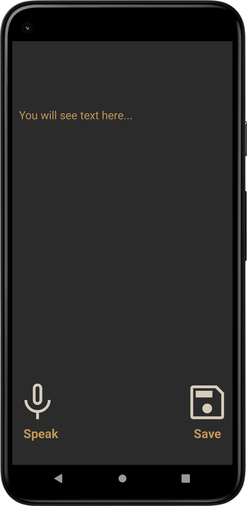

# AndroidSpeechToText
> <b>Author: Nicola De Nicolais</b>

## Screen preview

## 📍 Description
This application can provide speech input to your app using Kotlin Programming Language. 
Android comes with an inbuilt feature speech to text through which you can provide speech input to your app. With this you can add some of the cool features to your app like adding voice navigation(Helpful when you are targeting disabled people), filling a form with voice input etc.

## 💎 Features
Capture voice recording via microphone

Show recording in text on the display

Convert audio recording to text and save as a file. txt
